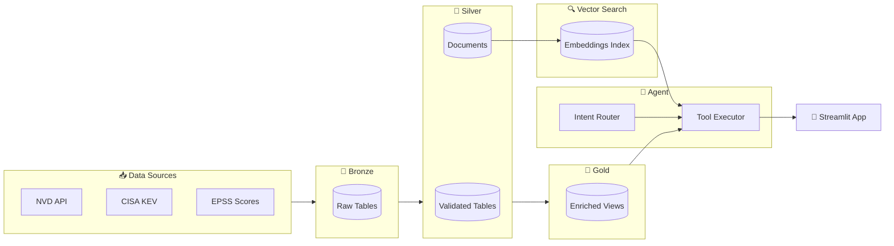

# VulnPulse: AI-Powered Vulnerability Intelligence

VulnPulse is an end-to-end vulnerability intelligence platform built on Databricks that aggregates data from multiple security sources (NVD, CISA KEV, EPSS), processes it through a medallion architecture, and provides an AI-powered conversational interface for security analysts to query, prioritize, and analyze vulnerabilities using natural language.

## ✨ Features

- **🗣️ Natural Language Queries** - Ask questions like "What critical vulnerabilities affect Apache?" or "Compare CVE-2024-3094 and CVE-2024-21762"
- **🔍 Semantic Search** - Find vulnerabilities by description, not just keywords, using Vector Search embeddings
- **📊 Risk Prioritization** - Automated risk scoring combining CVSS, EPSS exploitation probability, and CISA KEV status
- **📈 Trend Analysis** - Track recently exploited vulnerabilities and vendor risk aggregations
- **🏗️ Medallion Architecture** - Clean data pipeline with Bronze (raw), Silver (validated), and Gold (enriched) layers
- **✅ Data Quality** - DLT Expectations enforce data contracts and quality rules

## 🏛️ Architecture



## 🚀 Quick Start

### Prerequisites

- Python 3.10+
- Databricks workspace with Unity Catalog enabled
- Databricks CLI configured
- Git

### Installation

1. **Clone the repository**
   ```bash
   git clone https://github.com/yourusername/vulnpulse.git
   cd vulnpulse
   ```

2. **Create virtual environment**
   ```bash
   python -m venv .venv
   source .venv/bin/activate  # On Windows: .venv\Scripts\activate
   ```

3. **Install dependencies**
   ```bash
   pip install -r requirements.txt
   pip install -r requirements-app.txt  # For Streamlit app
   ```

4. **Configure environment**
   ```bash
   cp .env.example .env
   # Edit .env with your Databricks credentials:
   # DATABRICKS_HOST=https://your-workspace.cloud.databricks.com
   # DATABRICKS_TOKEN=your-token
   ```

5. **Fetch vulnerability data**
   ```bash
   python collector/fetch_all.py
   ```

6. **Deploy to Databricks**
   ```bash
   # Upload data to Volume
   make upload
   
   # Deploy pipelines and jobs
   databricks bundle validate
   databricks bundle deploy
   ```

7. **Run the app**
   ```bash
   streamlit run app/app.py
   ```

## 📁 Project Structure

```
vulnpulse/
├── collector/              # Data collection scripts
│   ├── fetch_nvd.py       # NVD vulnerability feed fetcher
│   ├── fetch_kev.py       # CISA KEV catalog fetcher
│   ├── fetch_epss.py      # EPSS scores fetcher
│   └── fetch_all.py       # Unified fetch script
├── databricks/
│   ├── bronze/            # Raw data ingestion notebooks
│   ├── silver/            # DLT pipeline for data validation
│   ├── gold/              # Enriched analytics tables
│   └── vector_search/     # Vector Search index setup
├── agent/
│   ├── tools/             # Agent tools (lookup, search, compare)
│   ├── router.py          # Intent classification
│   ├── orchestrator.py    # Main agent logic
│   └── synthesizer.py     # Response formatting
├── app/
│   ├── app.py             # Streamlit application
│   └── components/        # UI components
├── docs/
│   ├── architecture.md    # System architecture details
│   └── agent-design.md    # Agent design philosophy
├── data/raw/              # Local data storage (gitignored)
├── resources/             # Static resources
├── requirements.txt       # Core dependencies
├── requirements-app.txt   # Streamlit dependencies
└── databricks.yml         # Asset Bundle configuration
```

## 📊 Data Sources

| Source | Description | URL | Update Frequency |
|--------|-------------|-----|------------------|
| **NVD** | National Vulnerability Database - CVE details, CVSS scores, CWE classifications | [nvd.nist.gov](https://nvd.nist.gov/) | Daily |
| **CISA KEV** | Known Exploited Vulnerabilities Catalog - Actively exploited CVEs | [cisa.gov/known-exploited-vulnerabilities-catalog](https://www.cisa.gov/known-exploited-vulnerabilities-catalog) | As needed |
| **EPSS** | Exploit Prediction Scoring System - Probability of exploitation | [first.org/epss](https://www.first.org/epss/) | Daily |

## 🧮 Risk Scoring

VulnPulse calculates a unified risk score (0-100) using a hierarchical evaluation:

```
IF in CISA KEV (actively exploited)  → 90 + (epss_score × 10)     [90-100]
ELSE IF EPSS > 0.5                   → 70 + (epss_score × 20)     [70-90]
ELSE IF EPSS > 0.1                   → 40 + (epss_score × 50)     [45-90]
ELSE                                 → cvss_v3_score × 4          [0-40]
```

**Risk Tiers** (based on final score):
- 🔴 **CRITICAL** (≥90): Actively exploited vulnerabilities
- 🟠 **HIGH** (70-89): High exploitation probability
- 🟡 **MEDIUM** (40-69): Moderate exploitation probability
- 🟢 **LOW** (<40): CVSS-based technical severity

## 🤖 Agent Capabilities

The VulnPulse agent understands various query types:

| Query Type | Example | Tool Used |
|------------|---------|-----------|
| CVE Lookup | "What is CVE-2024-3094?" | `cve_lookup` |
| Filtered Search | "Critical vulnerabilities in Apache" | `sql_query` |
| Semantic Search | "Authentication bypass in web applications" | `vector_search` |
| Comparison | "Compare CVE-2024-21762 and CVE-2024-1709" | `comparison` |
| Trend Analysis | "What's been exploited this month?" | `trend_analysis` |

## 📖 Documentation

- [Architecture Overview](docs/architecture.md) - Detailed system design and data flow
- [Agent Design](docs/agent-design.md) - Intent routing and tool design philosophy

## 🛠️ Development

```bash
# Run tests
pytest

# Format code
black .

# Lint
ruff check .

# Validate Databricks bundle
databricks bundle validate
```

## 📄 License

This project is licensed under the MIT License - see the [LICENSE](LICENSE) file for details.

---

<p align="center">
  Built with ❤️ for security teams using <a href="https://databricks.com">Databricks</a>
</p>
